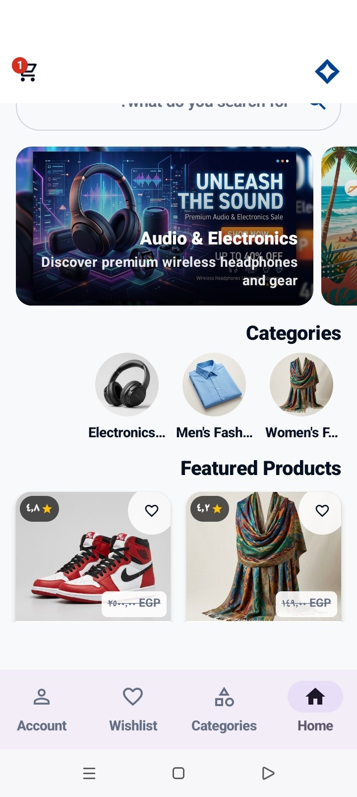
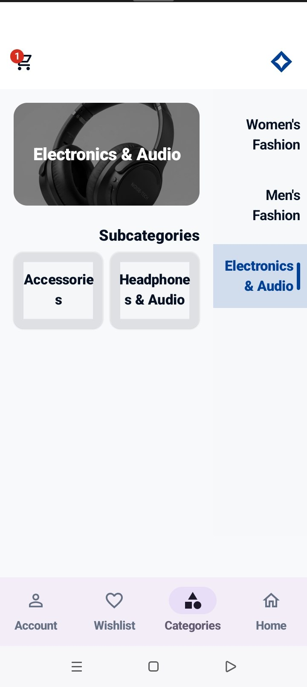
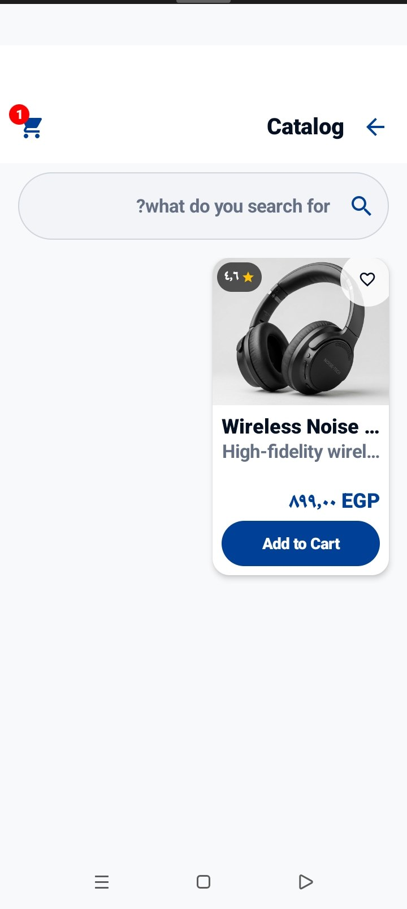
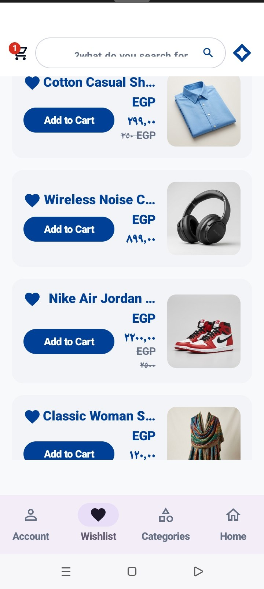
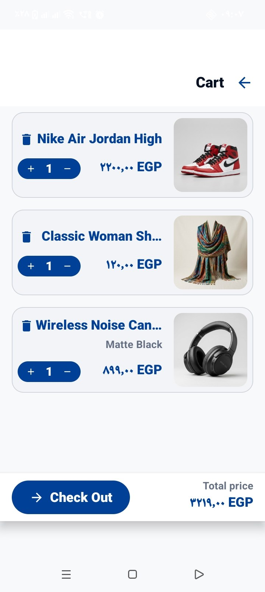
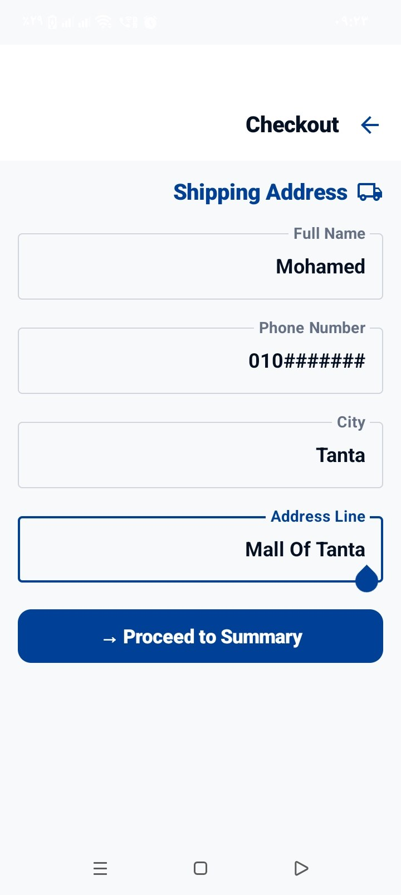

# Avenra

Avenra is an Android e-commerce portfolio application built around a Jetpack Compose user interface. It lets authenticated users browse a catalog, manage a wishlist and cart, and complete a server-validated checkout flow through a supporting REST API.

## Screenshots

| Home | Categories |
| --- | --- |
|  |  |

| Catalog | Wishlist |
| --- | --- |
|  |  |

| Cart | Checkout |
| --- | --- |
|  |  |

## Features

- Authentication with sign-up, sign-in, profile restoration, sign-out, and session invalidation.
- Home, catalog, categories, product details, and catalog search/category filtering.
- Local wishlist and cart management.
- Checkout quotes with Standard or Express delivery, followed by authenticated order creation.
- Persistent sessions, loading/empty/error states, and HTTP/network error handling.

## Tech Stack

**Android:** Kotlin, Jetpack Compose, MVVM, StateFlow, Retrofit, Room, EncryptedSharedPreferences, and Coil.

**Backend:** Node.js, TypeScript, Express, and a REST API.

## Architecture

`Compose UI → ViewModel → Repository → Remote API / Local data`

Compose screens render state exposed by ViewModels through `StateFlow`. Repositories coordinate Retrofit calls to the API and Room-backed local data; Room persists the cart and wishlist, while `EncryptedSharedPreferences` stores the signed-in session and cached profile securely.

## Authentication

- Users can sign up or sign in through the API.
- On launch, the app restores the saved profile and refreshes it from the current-profile endpoint when a session exists.
- Session data is retained in encrypted shared preferences.
- Signing out asks the API to revoke the session, then clears the local session even if the service cannot be reached.
- A `401 Unauthorized` response clears the local session so the app does not retain an invalid login.

## Cart & Checkout

Checkout is designed so the backend, rather than the Android client, is authoritative for pricing. The app submits product IDs and quantities to generate a quote, including the selected Standard or Express delivery method; the server validates stock and returns the price snapshot and totals.

Before creating an order, the server checks stock again, rejects price changes, and rejects expired quotes. Each order request uses an idempotency key to safely handle retries and prevent duplicate orders. The cart is cleared only after the backend confirms successful order creation.

## Backend

Supporting REST API built specifically for the Android application.

It provides catalog, authentication, checkout, and order endpoints with structured error handling and persistence for application state. It is intentionally a supporting service for the mobile app, not a claim of production infrastructure.

## Testing

The current repository was verified locally with:

- Android debug unit tests passed with zero failures via `./gradlew.bat testDebugUnitTest`.
- Android debug build: `./gradlew.bat assembleDebug` produced the debug APK.
- Backend API tests: all catalog/checkout, external-data fallback, and authentication test suites passed via `npm test`.

## Getting Started

### 1. Android app

Open the repository in Android Studio with JDK 17 and an installed Android SDK, or build from the repository root:

```powershell
.\gradlew.bat assembleDebug
```

The debug build uses `http://localhost:3000/` by default. For a device or emulator connected over ADB, expose the local API with:

```powershell
adb reverse tcp:3000 tcp:3000
```

Set `AVENRA_DEBUG_BASE_URL` as a Gradle property or environment variable to override the debug API base URL. Release builds use `AVENRA_RELEASE_BASE_URL`; it must be a public HTTPS URL, and release packaging also requires the configured signing inputs. Do not place secrets in source control.

### 2. Backend

With Node.js 18 or later installed:

```powershell
cd backend
npm install
Copy-Item .env.example .env
npm run dev
```

The sample environment file contains local development defaults. From the repository root, `./start-backend.ps1` is also available to start the backend and attempt the ADB reverse mapping.

## Project Structure

```text
app/        Android application: Compose UI, ViewModels, repositories, Retrofit, Room, and session storage
backend/    Supporting TypeScript/Express REST API, seed data, persistence services, and API tests
docs/       Project references and application screenshots
```

## Notes

The backend is a supporting service for the Android portfolio project.
